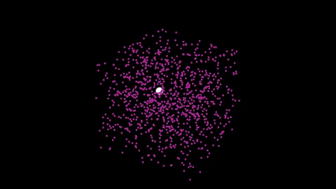

# libSIA - C++/Python stochastic estimation

[](https://gitlab.com/parkerowan/libsia/commits/master)
[](https://codecov.io/gl/parkerowan/libsia)



## Features
- Bayesian estimation including Kalman, extended Kalman, and particle filters.
- Markov processes for representing systems including Nonlinear/Gaussian, Linear/Gaussian, Discrete/Continuous time.
- Distributions for representing belief including Gaussian, uniform, particle, and Kernel density estimation (KDE).
- Runner and recorder for easy simulation and data trace collection.
- Math functions for runge-kutta integration, SVD-based matrix inversion.
- Python bindings.

## Build
- Install [Docker](https://www.docker.com/).  Check the included Dockerfile for project dependencies.
- Build the Docker container using `scripts/run --build`.
- Launch the Docker container using `scripts/run --bash`.
- Build and install the C++ package with cmake and make.
```bash
mkdir build && cd build
cmake ..
make && make install
make test
```
- Build and install the Python bindings with pip (C++ library must be installed first in previous step).  In the root directory
```bash
pip install --upgrade .
```

## Python examples
- [Belief representations/probability distributions](./examples/belief/README.md)
- TODO: System modeling
- TODO: Comparison of estimators
- [Lorenz attractor bimodal particle filtering](./examples/lorenz/README.md)
- TODO: Duffing oscillator parameter estimation
- TODO: Compartmental epidemiology estimation and forecasting

## Basic usage

SIA is native C++, with Python bindings using Pybind11


```python
import pysia as sia
import numpy as np

# Python and C++ APIs are intended to match 1:1, so python documentation is helpful for both
# help(sia)
```

Create an initial belief.  Options include Gaussian, Uniform, and Particles.  Here we create a normal distribution $`p(x) = \mathcal{N}(x|\mu, \Sigma)`$.


```python
Sigma = np.identity(2)
mu = np.array([0])
prior = sia.Gaussian(mean=mu, covariance=Sigma)

# Distributions provide methods for sampling and compute the log prob, mean, covariance, and mode
x = prior.sample()
prior.logProb(x)
prior.mean()
prior.mode()
prior.covariance();
```

Create a system to estimate.  Here we define a nonlinear function with additive Gaussian noise of the form
```math
\dot{x} = f(x, u) + C w, \quad w \sim \mathcal{N}(0, Q) \\
y = h(x) + v, \quad v \sim \mathcal{N}(0, R)
```
For nonlinear systems, we can define lambda functions for the dynamics $`f(x,u)`$ and measurement $`h(x)`$.  For specialized linear systems, where e.g. $`f(x,u) = Ax + Bu`$, we can pass matrices directly.  Both discrete time and continuous time (with methods to discretize) models are available.


```python
# Define the dynamics equation
f = lambda x, u: np.array([
    -0.1 * x[0] + 0.1 * u[0]
])

# Define the measurement equation
h = lambda x: x

# Define the process and measurement noise
Q = np.array([[1]])
C = np.array([[1]])
R = np.array([[0.1]])

system = sia.NonlinearGaussianCT(f, h, C, Q, R, dt=0.1)
```

Create an extended Kalman filter from the prior belief and the nonlinear system.  The general form is recursive Bayesian estimation with a prediction step that propogates the state estimate through dynamics $`q(\cdot)`$ (and increases uncertainty)
```math
p(x_k) = \int q(x_k | x_{k-1}, u_k) p(x_{k-1}) dx_{k-1}
```
and a correction step that updates the state estimate with measurements $`p(z|x)`$ (and decreases uncertainty)
```math
p(x_k | z_k) \propto p(z_k | x_k) p(x_k).
```
Available filters include Kalman, extended Kalman, and particle filters.  Check examples for detailed use of these filters.


```python
ekf = sia.ExtendedKalmanFilter(system, prior)

# Simulating dynamics and measurement for a system returns a belief, which can be sampled
x = np.array([0])
u = np.array([1])
x = system.dynamics(x, u).sample()
y = system.measurement(x).sample()

# Each step of the filter is run by calling estimate
belief = ekf.estimate(observation=y, control=u)

# or predict/correct can be called independently
belief = ekf.predict(control=u)
belief = ekf.correct(observation=y)
```

## References
- Crassidis and Junkins, *Optimal Estimation of Dynamic Systems*, 2nd Ed., CRC Press, 2012.
- Thrun, Burgard, and Fox, *Probabilistic Robotics: Intelligent Robotics and Autonomous Agents series*, MIT Press, 2006.
- Hardle et. al., *Nonparametric and Semiparametric Models: An Introduction*, Springer, 2004.
- Arulampalam et. al., "A Tutorial on Particle Filters for Online Nonlinear/Non-Gaussian Bayesian Tracking," IEEE Transactions on Signal Processing, 50-2, 2002.
