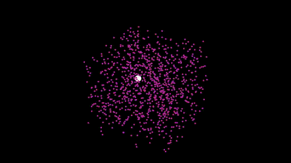
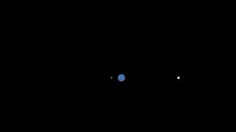
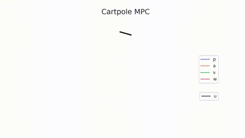

# libSIA - Stochastic Model-based Estimation and Control

[](https://gitlab.com/parkerowan/libsia/commits/master)
[](https://codecov.io/gl/parkerowan/libsia)

Sia is a C++/Python library for model-based Reinforcement Learning (or stochastic estimation and optimal control if you prefer). The current scope is on unconstrained continuous state and action vector spaces. Due to the focus on stochastic models, belief and dynamical systems are first-class representations. Algorithms included with the library are general purpose and can be applied to many different applications.

## Features
- Finite horizon model predictive control (MPC) including LQR, iLQR, and model predictive path integrals (MPPI).
- Bayesian estimation including Kalman, extended Kalman, and particle filters.
- Markov dynamical systems including nonlinear/Gaussian, linear/Gaussian, and their discrete/continuous time variants.
- Distributions for representing belief including Gaussian, Dirichlet, uniform, categorical, particle, Kernel densities (KDE), Gaussian mixture models (GMM), Gaussian mixture regression (GMR), Gaussian Process Regression (GPR), and Gaussian Process Classification (GPC).
- Built-in constrained Gradient Descent and Bayesian Optimization.
- Math functions for Runge-Kutta integration, SVD-based matrix inversion.
- Runner and recorder for easy simulation and data trace collection.
- Minimal dependencies in the core library (Eigen, glog).
- Python bindings with Pybind11.
- C++ and Python examples and tutorials.
- Extensive unit tests with gtest.
- BSD-3 permissive license.

## Gallery





## Build
- Install [Docker](https://www.docker.com/).  Check the included Dockerfile for project dependencies.
- Build the Docker container using `scripts/run --build`.
- Launch the Docker container using `scripts/run --bash`.
- Build and install the C++ package with cmake and make.
```bash
mkdir build && cd build
cmake ..
make && make install
make test
```
- Build and install the Python bindings with pip (C++ library must be installed first in previous step).  In the root directory, run
```bash
pip install --upgrade .
```

## Documentation
- [Belief representation](./docs/belief/belief.md)
- [System modeling](./docs/models/models.md)
- [State estimators](./docs/estimators/estimators.md)
- [Model predictive controllers](./docs/controllers/controllers.md)

## Examples
- [Linear motor control with LQR](./examples/motor/motor.md)
- [Chaotic Lorenz attractor particle filter estimation](./examples/lorenz/lorenz.md)
- [Celestial navigation with iLQR](./examples/navigator/navigator.md)
- [Underactuated cartpole control with iLQR, MPPI](./examples/cartpole/cartpole.md)

## Basic usage
SIA is native C++, with Python bindings using Pybind11.  Here we use a simple Python example to show the basics of how to create a continuous time POMDP system and solve it using an EKF estimator and iLQR controller.


```python
import pysia as sia
import numpy as np

# Python and C++ APIs are intended to match 1:1, so python documentation is helpful for both.
help(sia)
```

Create an initial belief in a state of dimension 2.  Options include Gaussian, Uniform, and Particles.  Here we create a normal distribution 
```math
p(x) = \mathcal{N}(x|\mu, \Sigma).
```

```python
# Distributions provide methods for sampling and computing statistics such as log prob, mean, covariance, and mode.
Sigma = np.identity(2)
mu = np.array([0, 0])
belief = sia.Gaussian(mean=mu, covariance=Sigma)
```

Create a system to estimate.  Here we define a function with additive Gaussian noise of the form
```math
\dot{x} = f(x, u) + C w, \quad w \sim \mathcal{N}(0, Q) \\
y = h(x) + v, \quad v \sim \mathcal{N}(0, R)
```
For nonlinear systems, we can define lambda functions for the dynamics *f(x,u)* and measurement *h(x)*.  In reality this specific system can be defined as a linear system, where e.g. *f(x,u) = Ax + Bu* and KF and LQR methods would suffice, but for illustrative purposes we show the nonlinear generalization.  Both discrete time and continuous time (with methods to discretize) models are available.


```python
# Define the dynamics equation, in this case a system with an unknown bias x[0]
# Note that only x[1] is controllable, so we will consider this when setting up
# the controller
f = lambda x, u: np.array([0, 0.1 * u[0] + x[0]])

# Define the measurement equation, assume we cannot directly observe the bias x[0]
h = lambda x: np.array([x[1]])

# Define the process and measurement noise
Q = np.diag([1e-8, 1e-4])
R = np.diag([1e-2])

# Create the models
dynamics = sia.NonlinearGaussianDynamicsCT(f, Q, dt=0.1)
measurement = sia.NonlinearGaussianMeasurementCT(h, R, dt=0.1)
```

Because we cannot directly observe the bias using the measurement above, we need to estimate it.  Initialize an extended Kalman filter from the prior belief and the nonlinear system to estimate the system state.  The general form is recursive Bayesian estimation with a prediction step that propogates the state estimate through a dynamics proposal *q()* (and increases uncertainty)
```math
p(x_k) = \int q(x_k | x_{k-1}, u_k) p(x_{k-1}) dx_{k-1}
```
and a correction step that updates the state estimate with measurements *p(z|x)* (and decreases uncertainty)
```math
p(x_k | z_k) \propto p(z_k | x_k) p(x_k).
```
Available filters include Kalman, extended Kalman, and particle filters.  Check examples for detailed use of these filters.


```python
# Create the estimator
ekf = sia.ExtendedKalmanFilter(dynamics, measurement, prior)
```

Suppose we would like to drive the controllable state to a new desired state.  Here we create an iLQR controller from the system to perform this control.  The general form of the model predictive controller is a policy 
```math
u^* &= \arg\min_u J(x, u)\\
&s.t. \begin{array}{l}
\dot{x} = f(x, u) \\
x_0 = x_k 
\end{array}\\
```
where the policy finds the optimal control for a cost function over a finite time horizon.  Each new belief update is used as the initial condition of the next optimization problem, which is seeded by the previous problem.  Available controllers include linear quadratic (LQR), iterative (iLQR), and model predictive path integrals (MPPI).

```python
# Define the cost
Qf = np.diag([0, 10])  # final state cost
Q = Qf                 # running state cost
R = np.diag([0.1])     # running control cost
xd = np.array([0, 1])  # desired state
cost = sia.QuadraticCost(Qf, Q, R, xd)

# Define the initial control for a horizon of T = 25 time steps
T = 25
u0 = [np.array([0]) for i in range(T)]

# Create the controller
ilqr = sia.iLQR(dynamics, cost, u0, max_iter=10)
```

With the estimator and the controller defined, we can now simulate the system for a few steps

```python
# Suppose the initial state doesn't quite match our belief
x = np.array([0.5, -1])

# Simulate for 50 time steps
N = 50
for i in range(N):
    # Compute a control using the belief in state
    u = ilqr.policy(state=belief)

    # Simulate the system forward and sample from the propogated distributions
    x = dynamics.dynamics(x, u).sample()
    y = measurement.measurement(x).sample()
    mu = belief.mean()
    print("Iteration {:2d}, x=[{:+.3f}, {:+.3f}], b(x)=[{:+.3f}, {:+.3f}]".
          format(i, x[0], x[1], mu[0], mu[1]))

    # Update the belief based on the measurement we took and the control we applied
    belief = ekf.estimate(observation=y, control=u)
```

And voila!  We are able to estimate the hidden state `x[0]` of 0.5, and the controllable state `x[1]` will be driven to our desired value of 1.  Because this system is stochastic, there will of course be some noise in the estimate and the tracking error.

For next steps, check out the documentation and examples.


## References
- Crassidis and Junkins, *Optimal Estimation of Dynamic Systems*, 2nd Ed., CRC Press, 2012.
- Thrun, Burgard, and Fox, *Probabilistic Robotics: Intelligent Robotics and Autonomous Agents series*, MIT Press, 2006.
- Hardle et. al., *Nonparametric and Semiparametric Models: An Introduction*, Springer, 2004.
- Arulampalam et. al., "A Tutorial on Particle Filters for Online Nonlinear/Non-Gaussian Bayesian Tracking," *IEEE Transactions on Signal Processing*, 50-2, 2002.
- Bohner and Wintz, "The Linear Quadratic Tracker on time scales," *Int. J. Dynamical Systems and Differential Equations*, Vol. 3, No. 4, 2011.
- Tassa et. al., "Synthesis and Stabilization of Complex Behaviors through Online Trajectory Optimization," *IEEE/RSJ International Conference on Intelligent Robots and Systems (IROS)*, 2012.
- Williams et. al., "Information Theoretic MPC for Model-Based Reinforcement Learning," *IEEE International Conference on Robotics and Automation (ICRA)*, 2017.
