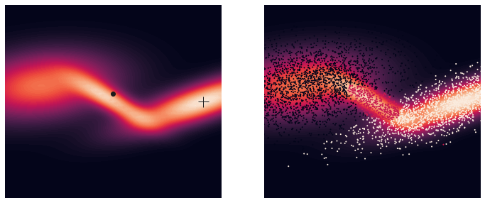
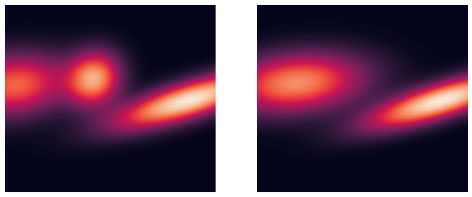
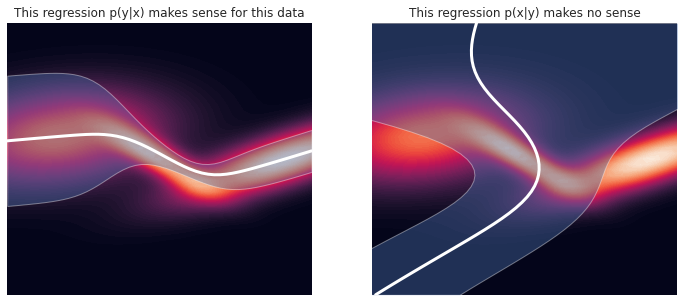
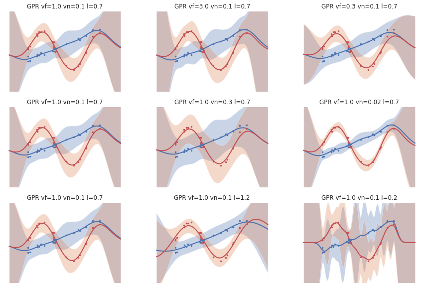
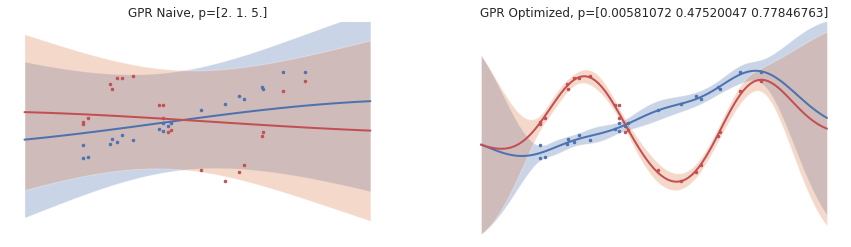
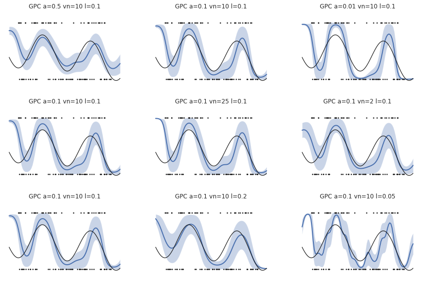
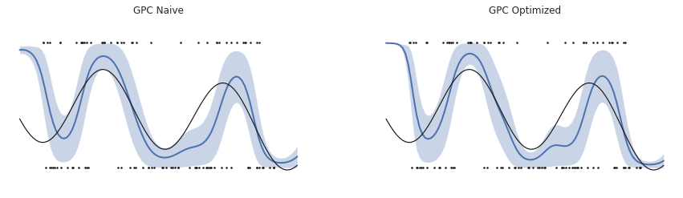

# Inference

Inference is a machine learning concept that extends on the concept of belief.  While belief models a random variable $x$ as a probability distribution $p(x)$, inference introduces the conditional probability $p(x|u)$, i.e. the belief in $x$ given an input $u$.  Inference is typically implemented as classification (predict discrete random variables) or regression (predict continuous random variables).  In `sia`, this is generalized as prediction via the `sia.Inference.predict()` method, where classification or regression is implied by the output distribution.  Inference is core to model-based estimation and control, and as such `sia` includes several common builtin inference techniques that subclass `sia.Inference`.  This example shows basic usage of inference.


```python
# Import the libSIA python bindings and numpy
import pysia as sia
import numpy as np

# Import plotting helpers
import matplotlib.pyplot as plt
import seaborn as sns
sns.set_theme(style="whitegrid")

# Set the generator instance seed for repeatability
generator = sia.Generator.instance()
generator.seed(10)
```

### Gaussian mixture models (GMM)

Sia provides a `sia.GMM` implementation for multimodal clustering and classification.  The GMM is a weighted combination of $N$ Gaussian clusters with a log likelihood defined by
$$
\log f(x) = \log \sum_i^N w_i \mathcal{N}(\mu_i,\Sigma_i)
$$

where the sum of priors (weights) $\sum_i w_i = 1$.  Sia provides a method to classify a sample by cluster using `sia.GMM.classify`.   This example shows a mixture model for a 2D GMM with 3 clusters.  The first plot shows the distribution mean and mode, and the second plot shows samples drawn from the model with colors determined by class.


```python
gaussians = [
    sia.Gaussian(mean=np.array([-2.0, 0.5]),
                 covariance=np.array([[2, 0.2], [0.2, 0.5]])),
    sia.Gaussian(mean=np.array([0.0, 0.0]),
                 covariance=np.array([[0.5, -0.3], [-0.3, 0.25]])),
    sia.Gaussian(mean=np.array([2.5, 0.0]),
                 covariance=np.array([[2.0, 0.7], [0.7, 0.4]]))
]
priors = [0.5, 0.1, 0.4]
gmm = sia.GMM(gaussians, priors)

# Draw samples from the distribution and classify
num_samples = 5000
samples = gmm.samples(num_samples)
classes = [gmm.classify(x) for x in samples]
samples = np.array(samples)

# Plot the probabilities
f, ax = plt.subplots(nrows=1, ncols=2, figsize=(12, 5))
ax = ax.flat
sns.despine(f, left=True, bottom=True)

# Evaluate the probability using sia.Distribution.logProb(x)
x = np.linspace(-3, 3, 51)
y = np.linspace(-3, 3, 51)
xx, yy = np.meshgrid(x, y)
for i in range(2):
    
    # Helper to evaluate the probability for multiple samples
    prob = np.exp(sia.logProb2d(gmm, xx.flatten(), yy.flatten()))
    ax[i].contourf(xx, yy, np.reshape(prob, xx.shape), levels=100)
    
    # Show the mean '.' and mode '+' in the first plot
    if i == 0:
        # NOTE: The mode computation is clearly wrong
        mean = gmm.mean()
        ax[i].plot(mean[0], mean[1], ".k", ms=12)
        mode = gmm.mode()
        ax[i].plot(mode[0], mode[1], "+k", ms=15)
        
    # Plot samples and classes by color
    elif i == 1:
        ax[i].scatter(samples[:, 0], samples[:, 1], s=1, c=classes)
    
    ax[i].set_xlim((-3, 3))
    ax[i].set_ylim((-3, 3))
    ax[i].axis("off")
    i+=1

plt.show()
```


    

    


For convenience, `sia.GMM` also provides a constructor for fitting the model to sample data using the Expectation-Maximization (EM) algorithm initialized via kmeans.  If more flexilibility is needed, the `sia.GMM.fit` routine offers options for warm start initialization versus random initialization.  For functionality beyond this, a more advanced and focused Machine Learning library such as `scikit-learn` is recommended.  The following example shows fitting the data above with a new model learning from EM.


```python
# Add regularization to the covariances to make sure they are positive definite
gmm_fits = [
    sia.GMM(samples.T, K=3, regularization=1e-2),
    sia.GMM(samples.T, K=2, regularization=1e-3),
]

# Plot the probabilities
f, ax = plt.subplots(nrows=1, ncols=2, figsize=(12, 5))
ax = ax.flat
sns.despine(f, left=True, bottom=True)

# Evaluate the probability using sia.Distribution.logProb(x)
x = np.linspace(-3, 3, 51)
y = np.linspace(-3, 3, 51)
xx, yy = np.meshgrid(x, y)
for i in range(2):
    # Helper to evaluate the probability for multiple samples
    prob_fit = np.exp(sia.logProb2d(gmm_fits[i], xx.flatten(), yy.flatten()))
    ax[i].contourf(xx, yy, np.reshape(prob_fit, xx.shape), levels=100)
    ax[i].set_xlim((-3, 3))
    ax[i].set_ylim((-3, 3))
    ax[i].axis("off")
    i+=1

plt.show()
```


    

    


### Gaussian mixture regression (GMR)

`sia.GMR` implements regression that extends GMM to conditional distributions.  It treats some of the state space as an input $x$ and some of it as an output $y$, and therefore only makes sense for distributions with 2 dimensions or more (1 axis for input, 1 for output).  With this separation, GMM is a generative model over the joint probability
$$
p(x, y)
$$
Gaussian mixture regression conditions on this model to predict
$$
p(y|x) = \mathcal{N}(\mu(x), \Sigma(x))
$$
where $\mu(x)$ and $\Sigma(x)$ are determined via Gaussian conditioning on the mixture.  The model is locally linear.  The covariance over the input space and mixture weights determine the contribution of each model, making it similar to a Kernel method.  GMR is particularly useful for learning models of dynamics or sensor measurements.  This example shows the GMM above now with conditioning applied.  On the left case, it is $p(x_2 | x_1)$ and the right case is $p(x_1 | x_2)$.  Note that the multiple intercepts along $y$ are blended in the right case.  This is shown to indicate that applying GMR over arbitrary inputs/outputs to a GMM does not make sense, you need to know the causality of your data to choose this appropriately.


```python
# Plot the probabilities
f, ax = plt.subplots(nrows=1, ncols=2, figsize=(12, 5))
ax = ax.flat
sns.despine(f, left=True, bottom=True)

x = np.linspace(-3, 3, 51)
y = np.linspace(-3, 3, 51)

# Case 1: condition on the first variable 'x' to predict the second variable 'y'
gmr1 = sia.GMR(gmm, [0], [1])
gmr1_mu = np.zeros(len(x))
gmr1_sig = np.zeros(len(x))
for i in range(len(x)):
    gaussian = gmr1.predict(np.array([x[i]]))
    gmr1_mu[i] = gaussian.mean()[0]
    gmr1_sig[i] = gaussian.covariance()[0, 0]
ax[0].contourf(xx, yy, np.reshape(prob, xx.shape), levels=100)
ax[0].fill_between(x, gmr1_mu + 3 * gmr1_sig, gmr1_mu - 3 * gmr1_sig, alpha=0.4)
ax[0].plot(x, gmr1_mu, 'w', lw=3)
ax[0].set_xlim((-3, 3))
ax[0].set_ylim((-3, 3))
ax[0].axis("off")
ax[0].set_title("This regression p(y|x) makes sense for this data")

# Case 2: condition on the second variable 'y' to predict the first variable 'x'
gmr2 = sia.GMR(gmm, [1], [0])
gmr2_mu = np.zeros(len(y))
gmr2_sig = np.zeros(len(y))
for i in range(len(y)):
    gaussian = gmr2.predict(np.array([y[i]]))
    gmr2_mu[i] = gaussian.mean()[0]
    gmr2_sig[i] = gaussian.covariance()[0, 0]
ax[1].contourf(xx, yy, np.reshape(prob, xx.shape), levels=100)
ax[1].fill_betweenx(y, gmr2_mu + 3 * gmr2_sig, gmr2_mu - 3 * gmr2_sig,  alpha=0.4)
ax[1].plot(gmr2_mu, y, 'w', lw=3)
ax[1].set_xlim((-3, 3))
ax[1].set_ylim((-3, 3))
ax[1].axis("off")
ax[1].set_title("This regression p(x|y) makes no sense")

plt.show()
```


    

    


## Gaussian Process Regression (GPR)

`sia.GPR` implements a multi-dimensional Gaussian Process Regression model that predicts an uncorrelated output vector $y$ given an input vector $x$ for a posterior statistical function $f$
$$
p(y|x) = \mathcal{N}(\mathbb{E}[f(x)], \mathbb{V}[f(x)])
$$
Note that because the output vector is uncorrelated, the output variance $\mathbb{V}[f(x)]$ is a diagonal matrix.  GPR is a  hyperparameteric kernel-based method.  The GP has several hyperparameters $\sigma_f^2$, $\sigma_n^2$, and $l$.  The variance $\sigma_f^2$ controls the uncertainty of the prior distribution, i.e. in regions where there is no training data.  The variance $\sigma_n^2$ determines the uncertainty of the likelihood, i.e. the measurement noise.  The length $l$ is a kernel smoothing term.  Effects of these hyperparameters are shown below.  The top row demonstrates $\sigma_f^2$ (`vf`) where the uncertainty at the boundaries (dominated by the prior) is modified; middle shows $\sigma_n^2$ (`vn`) where the measurement noise is changed, and the bottom shows $l$ (`l`) with more or less blending of the likelihood between training data in $x$.


```python
# Generate training data from underlying function
xtrain = np.random.uniform(0, 4, 21)
v = 0.1 * np.random.randn(2, len(xtrain))
ytrain = np.vstack((0.4 * xtrain - 0.5, np.sin(2 * xtrain))) + v

# Plot the raw data
f, ax = plt.subplots(nrows=3, ncols=3, figsize=(15, 10))
ax = ax.flat
sns.despine(f, left=True, bottom=True)

# Evaluate several choices of hyper parameters
varf   = [1.0, 3.0, 0.3, 1.0, 1.0, 1.0, 1.0, 1.0, 1.0]
varn   = [0.1, 0.1, 0.1, 0.1, 0.3, 0.02, 0.1, 0.1, 0.1]
length = [0.7, 0.7, 0.7, 0.7, 0.7, 0.7, 0.7, 1.2, 0.2]

for i in range(len(ax)):
    # Create the GPR object
    gpr = sia.GPR(np.array([xtrain]), ytrain, varn=varn[i], varf=varf[i], length=length[i])

    # Evaluate it
    xtest = np.linspace(-1, 5, 101)
    gpr_mu = np.zeros((2, len(xtest)))
    gpr_sig = np.zeros((2, len(xtest)))
    for k in range(len(xtest)):
        gaussian = gpr.predict(np.array([xtest[k]]))
        gpr_mu[:, k] = gaussian.mean()
        gpr_sig[:, k] = np.sqrt(np.diag(gaussian.covariance()))
    
    # Plot the belief for each axis and overlay the training data
    ax[i].fill_between(xtest, gpr_mu[0, :] + 3 * gpr_sig[0, :], gpr_mu[0, :] - 3 * gpr_sig[0, :],  alpha=0.3)
    ax[i].plot(xtest, gpr_mu[0, :], 'b', lw=2)
    ax[i].fill_between(xtest, gpr_mu[1, :] + 3 * gpr_sig[1, :], gpr_mu[1, :] - 3 * gpr_sig[1, :],  alpha=0.3)
    ax[i].plot(xtest, gpr_mu[1, :], 'r', lw=2)
    ax[i].plot(xtrain, ytrain[0, :], '.b', ms=5)
    ax[i].plot(xtrain, ytrain[1, :], '.r', ms=5)
    ax[i].set_ylim((-2, 2))
    ax[i].axis("off")
    ax[i].set_title("GPR vf={} vn={} l={}".format(varf[i], varn[i], length[i]));
```


    

    


**Hyperparameter optimization.** GPR provides a `GRP.train()` method to optimizer the hyperparameters using a native projected gradient descent optimizer.  If optimization with a 3rd party library is needed, GPR provides a loss function `GPR.negLogMarginalLik()` of the training data and parameter access via `GPR.getHyperparameters()` that make it easy to plug in to a 3rd party optimzer, such as scipy.  Here we optimize the GPR hyperparameters using the native optimizer.


```python
gpr_naive = sia.GPR(np.array([xtrain]), ytrain, 2, 1, 5)
gpr_optm = sia.GPR(np.array([xtrain]), ytrain, 2, 1, 5)
gpr_optm.train()

models = {
    "Naive": gpr_naive,
    "Optimized": gpr_optm
}

# Plot the raw data
f, ax = plt.subplots(nrows=1, ncols=2, figsize=(15, 4))
ax = ax.flat
sns.despine(f, left=True, bottom=True)

for i in range(len(models.values())):
    key = list(models.keys())[i]
    
    # Evaluate it
    xtest = np.linspace(-1, 5, 101)
    gpr_mu = np.zeros((2, len(xtest)))
    gpr_sig = np.zeros((2, len(xtest)))
    for k in range(len(xtest)):
        gaussian = models[key].predict(np.array([xtest[k]]))
        gpr_mu[:, k] = gaussian.mean()
        gpr_sig[:, k] = np.sqrt(np.diag(gaussian.covariance()))
    
    # Plot the belief for each axis and overlay the training data
    ax[i].fill_between(xtest, gpr_mu[0, :] + 3 * gpr_sig[0, :], gpr_mu[0, :] - 3 * gpr_sig[0, :],  alpha=0.3)
    ax[i].plot(xtest, gpr_mu[0, :], 'b', lw=2)
    ax[i].fill_between(xtest, gpr_mu[1, :] + 3 * gpr_sig[1, :], gpr_mu[1, :] - 3 * gpr_sig[1, :],  alpha=0.3)
    ax[i].plot(xtest, gpr_mu[1, :], 'r', lw=2)
    ax[i].plot(xtrain, ytrain[0, :], '.b', ms=5)
    ax[i].plot(xtrain, ytrain[1, :], '.r', ms=5)
    ax[i].set_ylim((-2, 2))
    ax[i].axis("off")
    ax[i].set_title("GPR {}, p={}".format(key, models[key].getHyperparameters()));
```


    

    


## Gaussian Process Classification (GPC)

`sia.GPC` implements a multi-dimensional Gaussian Process Classification model that predicts a Dirichlet distribution $p(y|x) = \mathcal{D}(x)$ to describe the softmax probability of seeing a class.  The dimension of the output Dirichlet distribution is based on the max class presented in the training data.  GPC has several hyperparameters $\alpha$, $\sigma_n^2$, and $l$.  The baseline concentration $1 > \alpha > 0$ controls the uncertainty of the Dirichlet prior.  The variance $\sigma_n^2$ determines the uncertainty of the likelihood, i.e. the measurement noise.  The length $l$ is a kernel smoothing term.  Effects of these hyperparameters are shown below.  The top row demonstrates $\alpha$ (`a`), middle shows $\sigma_n^2$ (`vn`), and the bottom shows $l$ (`l`).


```python
# Generate training data from underlying probability of a binary class
class_prob = lambda x : -0.2 * x ** 2 + 0.6 * np.sin(6 * x) ** 2 + 0.2
# class_prob = lambda x : x >= 0.5

ntrain = 100
xtrain = np.random.uniform(0, 1, ntrain)
ptrain = class_prob(xtrain)
ytrain = np.array([int(np.random.uniform(0, 1, 1) <= class_prob(x)) for x in xtrain])

# Plot the raw data
f, ax = plt.subplots(nrows=3, ncols=3, figsize=(15, 10))
ax = ax.flat
sns.despine(f, left=True, bottom=True)

# Evaluate several choices of hyper parameters
alpha  = [0.5, 0.1, 0.01, 0.1, 0.1, 0.1, 0.1, 0.1, 0.1]
varn   = [10, 10, 10, 10, 25, 2, 10, 10, 10]
length = [0.1, 0.1, 0.1, 0.1, 0.1, 0.1, 0.1, 0.2, 0.05]

for i in range(len(ax)):
    # Create the GPC object
    gpc = sia.GPC(np.array([xtrain]), ytrain, alpha=alpha[i], varf=varn[i], length=length[i])

    # Evaluate it
    xtest = np.linspace(-0.1, 1.1, 101)
    ptest = class_prob(xtest)
    gpc_mu = np.zeros((2, len(xtest)))
    gpc_sig = np.zeros((2, len(xtest)))
    for k in range(len(xtest)):
        dirichlet = gpc.predict(np.array([xtest[k]]))
        gpc_mu[:, k] = dirichlet.mean()
        gpc_sig[:, k] = np.diag(dirichlet.covariance())
    
    # Plot the belief for each axis and overlay the training data
    ax[i].fill_between(xtest, gpc_mu[1, :] + 2 * gpc_sig[1, :], gpc_mu[1, :] - 2 * gpc_sig[1, :],  alpha=0.3)
    ax[i].plot(xtest, gpc_mu[1, :], 'b', lw=2)
    ax[i].plot(xtrain, ytrain, '.k', ms=3)
    ax[i].plot(xtest, ptest, 'k', lw=1.2)
    ax[i].set_ylim((-0.2, 1.2))
    ax[i].axis("off")
    ax[i].set_title("GPC a={} vn={} l={}".format(alpha[i], varn[i], length[i]));
```


    

    


```python
from scipy.optimize import minimize

gpc_naive = sia.GPC(np.array([xtrain]), ytrain, alpha=0.1, varf=10, length=0.1)
gpc_optm = sia.GPC(np.array([xtrain]), ytrain, alpha=0.1, varf=10, length=0.1)

def loss(p: np.array) -> float:
    gpc_optm.setHyperparameters(p)
    return gpc_optm.negLogMarginalLik()

# Optimize the hyperparameters using the L-BFGS-B algorithm
# and the negative log likelihood loss function provided by the sia.GPR
res = minimize(loss, 
               x0=gpc_optm.getHyperparameters(),                
               bounds=((1e-1, 1e1), (1e-1, 50), (1e-1, 50)),
               options={'disp': True},
               method='L-BFGS-B')
gpc_optm.setHyperparameters(res.x)
print(gpc_naive.getHyperparameters())
print(gpc_optm.getHyperparameters())

models = {
    "Naive": gpc_naive,
    "Optimized": gpc_optm
}

# Plot the raw data
f, ax = plt.subplots(nrows=1, ncols=2, figsize=(15, 4))
ax = ax.flat
sns.despine(f, left=True, bottom=True)

for i in range(len(models.values())):
    key = list(models.keys())[i]
    
    # Evaluate it
    xtest = np.linspace(-0.1, 1.1, 101)
    ptest = class_prob(xtest)
    gpc_mu = np.zeros((2, len(xtest)))
    gpc_sig = np.zeros((2, len(xtest)))
    for k in range(len(xtest)):
        dirichlet = models[key].predict(np.array([xtest[k]]))
        gpc_mu[:, k] = dirichlet.mean()
        gpc_sig[:, k] = np.diag(dirichlet.covariance())
    
    # Plot the belief for each axis and overlay the training data
    ax[i].fill_between(xtest, gpc_mu[1, :] + 2 * gpc_sig[1, :], gpc_mu[1, :] - 2 * gpc_sig[1, :],  alpha=0.3)
    ax[i].plot(xtest, gpc_mu[1, :], 'b', lw=2)
    ax[i].plot(xtrain, ytrain, '.k', ms=3)
    ax[i].plot(xtest, ptest, 'k', lw=1.2)
    ax[i].set_ylim((-0.2, 1.2))
    ax[i].axis("off")
    ax[i].set_title("GPC {}".format(key));
```

    [ 0.1 10.   0.1]
    [ 0.1 50.   0.1]


    

    

