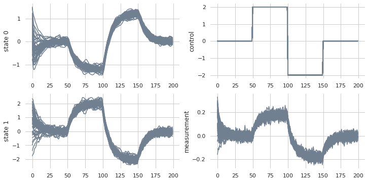

# System modeling

In `sia`, the base `sia.MarkovProcess` model defines two functions that need to be implemented:
- *Dynamics model.*  This model predicts $`p(x_k | x_{k-1}, u_k)`$, i.e. the statistical propogation from state $`x_{k-1}`$ to $`x_k`$ given a control $`u_k`$.  There are two flavors of this dynamics model:
  - *Discrete time.*  In this case the user provides the equation above which makes implicit assumptions about the time step.
  - *Continuous time.*  In this case the user provides an equation $`p(\dot{x} | x, u)`$ and a timestep $`\Delta t`$.  The state propogation is then found via Runge Kutta integration.
- *Measurement model.*  This model predicts $`p(y | x)`$, i.e. the statistical measurement $`y`$ from state $`x`$.

`sia` provides several classes to implement these functions.  Each makes different assumptions about the structure of the model equations.


```python
# Import the libSIA python bindings and numpy
import pysia as sia
import numpy as np

# Import plotting helpers
import matplotlib.pyplot as plt
import seaborn as sns
sns.set_theme(style="whitegrid")

# Set the generator instance seed for repeatability
generator = sia.Generator.instance()
generator.seed(1)
```

## Linear Gaussian Systems
Linear Gaussian systems make linear assumptions about the dynamics and measurement equations and assume that noise is added linearly.  This system representation is required for the Kalman filter estimator.

*Discrete Time.*  This model is created with `sia.LinearGaussian`, and the system equations is

```math
x_k = F x_{k-1} + G u_k + C w_k,\quad w_k \sim \mathcal{N}(0, Q) \\
y_k = H x_k + v_k,\quad v_k \sim \mathcal{N}(0, R)
```

*Continuous Time.*  This model is created with `sia.LinearGaussianCT`, and the system equations is

```math
\dot{x} = A x + B u + C w,\quad w \sim \mathcal{N}(0, Q) \\
y = H x + v,\quad v \sim \mathcal{N}(0, R)
```

Below is an example that simulates multiple trajectories for a discrete time Linear/Gaussian system.


```python
# Create a linear Gaussian system
linear_system = sia.LinearGaussian(
    F=np.array([[0.5, -0.3], [0, 0.9]]),
    G=np.array([[0], [0.1]]),
    C=np.array([[0], [1.0]]),
    H=np.array([[0.1, 0.15]]),
    Q=np.array([[5e-3]]), 
    R=np.array([[2e-4]]))

# Create a positive/negative step command
u = np.zeros((1, 200))
u[0, 50:] = 2
u[0, 100:] = -2
u[0, 150:] = 0

# Create an initial state distribution
initial_state = sia.Gaussian(np.ones(2), np.identity(2))
x = initial_state.samples(num_samples=50)

# Simulate the system with noise for the input vector
trajectories = sia.simulate(linear_system, x, u, sample=True)

# Plot the trajectories from the simulation
f, ax = plt.subplots(nrows=2, ncols=2, figsize=(12, 6))
sns.despine(f, left=True, bottom=True)
for traj in trajectories.data():
    ax[0, 0].plot(traj.states[0, :], color="slategray")
    ax[0, 0].set_ylabel("state 0")
    
    ax[1, 0].plot(traj.states[1, :], color="slategray")
    ax[1, 0].set_ylabel("state 1")
        
    ax[0, 1].plot(traj.controls[0, :], color="slategray")
    ax[0, 1].set_ylabel("control")
        
    ax[1, 1].plot(traj.measurements[0, :], color="slategray")
    ax[1, 1].set_ylabel("measurement")
plt.show()
```


    

    


## Nonlinear Gaussian Systems
Nonlinear Gaussian systems relax the linear assumptions about the dynamics and measurement equations, but still assume that noise is added linearly.

*Discrete Time.*  This model is created with `sia.NonlinearGaussian`, and the system equations is

```math
x_k = f(x_{k-1}, u_k) + C w,\quad w \sim \mathcal{N}(0, Q) \\
y = h(x) + v,\quad v \sim \mathcal{N}(0, R)
```

*Continuous Time.*  This model is created with `sia.NonlinearGaussianCT`, and the system equations is

```math
\dot{x} = f(x, u) + C w,\quad w \sim \mathcal{N}(0, Q) \\
y = h(x) + v,\quad v \sim \mathcal{N}(0, R)
```

Below is an example that simulates multiple trajectories for a continuous time Nonlinear Gaussian system.


```python
# Initialize dynamics for the Duffing oscillator
dynamics = lambda x, u: np.array([
    x[1],
    -0.02 * x[1] - x[0] - 5 * x[0]**3 + 8 * u
])

# Observe the velocity state
measurement = lambda x: np.array([x[1]])

# Sample rate (s)
dt = 0.01

# Create the system
nonlinear_system = sia.NonlinearGaussianCT(
    dynamics, 
    measurement, 
    C=np.array([[0], [1.0]]),
    Q=np.array([[1e-2]]), 
    R=np.array([[1e-4]]),
    dt=dt)

# Create a sinusoidal control
t = np.arange(0, 2+dt, dt)
u = np.cos(0.5 * t)
u = np.reshape(u, (1, len(t)))

# Create an initial state distribution
initial_state = sia.Gaussian(np.ones(2), np.identity(2))
x = initial_state.samples(num_samples=500)

# Simulate the system with noise for the input vector
trajectories = sia.simulate(nonlinear_system, x, u, sample=True)

# Plot the states at different snapshots in time
indices = np.linspace(0, len(t)-1, 12).astype(int)
f, ax = plt.subplots(nrows=3, ncols=4, figsize=(15, 10))
xx, yy = np.meshgrid(np.linspace(-4, 4, 51), np.linspace(-15, 15, 51))
ax = ax.flat
sns.despine(f, left=True, bottom=True)
for i in range(len(indices)):
    # Retrieve the samples at snapshot index
    k = indices[i]
    samples = trajectories.states(k)
        
    # Create a kernel density from the samples for the trajectory
    dist = sia.KernelDensity(samples, np.ones(trajectories.size()),
                             type=sia.Kernel.EPANECHNIKOV, bandwidth_scaling=2)
    prob = np.exp(sia.logProb2d(dist, xx.flatten(), yy.flatten()))
    ax[i].contourf(xx, yy, np.reshape(prob, xx.shape), levels=100)
    ax[i].scatter(samples[0, :], samples[1, :], s=2, color="white")
    ax[i].set_xlim([-4, 4])
    ax[i].set_ylim([-15, 15])
    ax[i].axis("off")
    ax[i].set_title("k={}".format(k))
plt.show()
```


    

    

